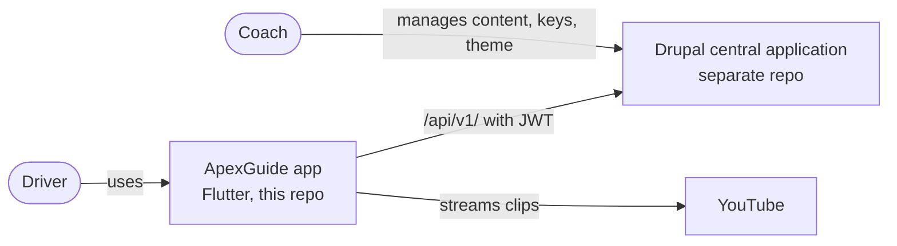
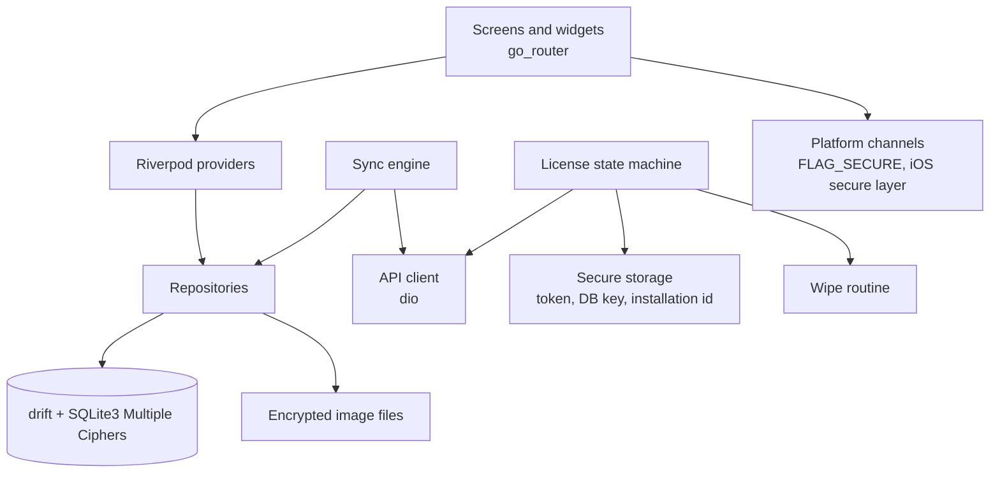
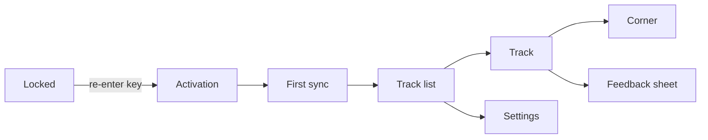

# ApexGuide Architecture

High-level architecture of the ApexGuide mobile app. Detailed requirements, the API contract and the license rules live in the spec: `docs/specs/Track Guide – Project & Implementation Plan.md`.

---

## System context

The app is offline-first. It only reaches the internet for activation, the daily license check, sync, feedback and YouTube playback.

---

## App layers

| Layer | Responsibility |
| --- | --- |
| UI | Screens from the Claude Design prototype (DEC-007); never touches the database directly |
| State | Riverpod providers exposing repositories and license state |
| Repositories | Read and write the local database and image files |
| Sync engine | Delta sync on every app start (SYN-001) |
| License state machine | Activation, daily refresh, expiry, revocation, clock-tamper guard (LIC-003) |
| API client | dio, bearer token, error mapping; mock API for development (DEC-003) |
| Platform channels | Content protection on Android and iOS (DEC-005) |

---

## Screens

License state gates everything below the activation screen.

---

## Data

- Local database schema: `docs/database/mobile-erd.md` (DEC-008)
- Secure storage holds the license token, database key and installation id
- Layout images and logo are stored encrypted on disk

---

## Key decisions

See `.claude/memory/decisions.md`:

| ID | Decision |
| --- | --- |
| DEC-001 | Flutter app only in this repo; Drupal is external |
| DEC-002 | App technology stack (superseded by DEC-010) |
| DEC-003 | Build against a mock API from the frozen contract |
| DEC-004 | License model: 7-day JWT bound to one installation |
| DEC-005 | Content protection layers |
| DEC-006 | iOS builds on a GitHub Actions macOS runner |
| DEC-007 | Claude Design prototype is the visual source of truth |
| DEC-008 | Local database schema |
| DEC-009 | Demo mode via a server-side demo tenant and shared demo key |
| DEC-010 | App stack verified and pinned: SQLite3 Multiple Ciphers and youtube_player_iframe |
| DEC-011 | Project conventions: app ID, minimum versions, folder layout, lints, build config |
