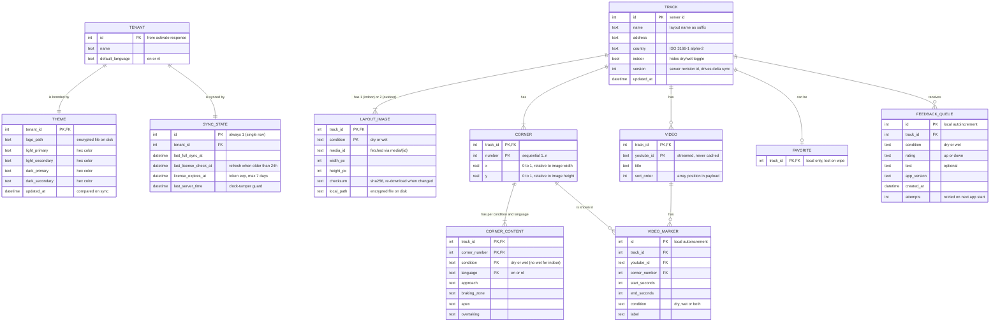
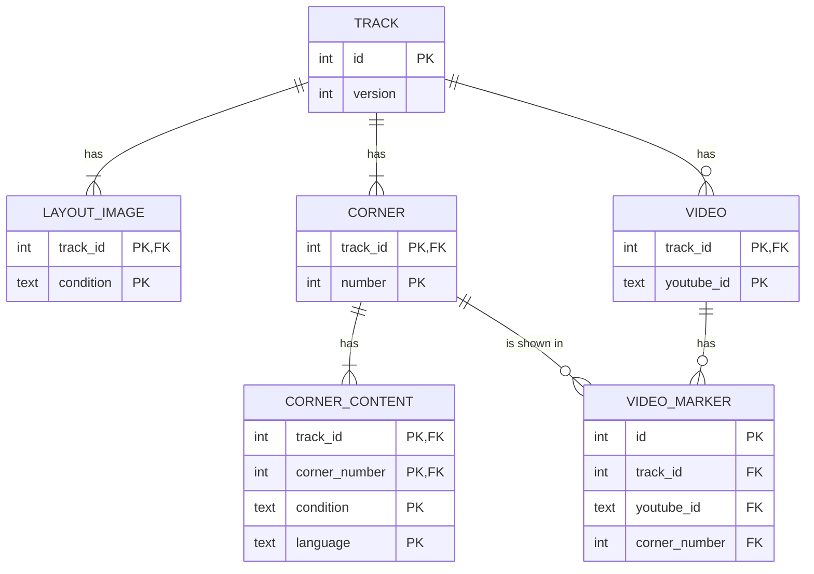
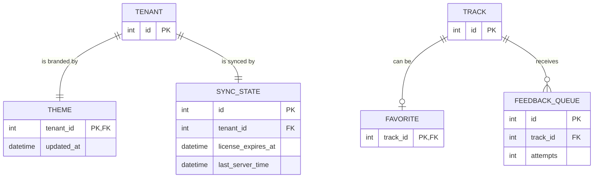
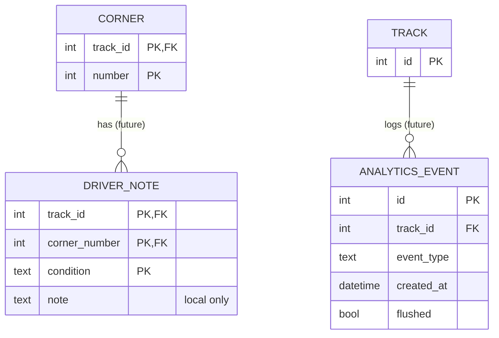

# ApexGuide Mobile – Local Database ERD

Status: **Proposal**, not implemented yet. Based on `docs/specs/Track Guide – Project & Implementation Plan.md` (Data model, API contract, Content protection).

Engine: SQLite encrypted with SQLite3 Multiple Ciphers, accessed through drift (DEC-010). The database key is generated per install and stored in Android Keystore / iOS Keychain.

---

## 1. Full overview

---

## 2. Track content (synced from the central application)

Everything in this group is replaced in **one transaction per track** during sync (`tracks/{id}`), so a half-finished sync never shows.

Row counts per corner in `CORNER_CONTENT`:

| Track type | Conditions | Languages | Rows per corner |
| --- | --- | --- | --- |
| Outdoor | dry, wet | en, nl | 4 |
| Indoor | dry | en, nl | 2 |

---

## 3. License, theme and local-only state

---

## 4. Data kept outside the database

Some things the app needs are not stored in the database. They live in secure storage or as encrypted files:

| Item | Where | Survives wipe? |
| --- | --- | --- |
| Installation id | Android: app-scoped `ANDROID_ID`; iOS: Keychain UUID | **Yes**, the only item kept |
| Database encryption key | Android Keystore / iOS Keychain (`whenUnlockedThisDeviceOnly`) | No |
| License token (JWT) | flutter_secure_storage | No |
| Layout images and logo | App sandbox, encrypted with the DB key; path in `LAYOUT_IMAGE.local_path` / `THEME.logo_path` | No |
| UI preferences (theme mode, language, track-day mode) | Shared preferences | No |

---

## 5. Sync and wipe rules per table

| Table | Written by | Deleted when |
| --- | --- | --- |
| TENANT, THEME | `activate`; THEME refreshed via `tenant/theme` | Wipe |
| SYNC_STATE | `activate`, `license/refresh`, every sync | Wipe |
| TRACK and its children | `tracks/{id}` when the version changed | Track marked deleted or missing from `tracks` index; wipe |
| FAVORITE | User | Track removed (cascade); wipe |
| FEEDBACK_QUEUE | Feedback sheet while offline | Successfully sent (`201`); wipe |

All foreign keys to `TRACK` use `ON DELETE CASCADE`, so removing a track removes its images, corners, content, videos, markers, favorite and queued feedback in one go.

---

## 6. Deviations from the spec's data model

The spec's data model describes the server. The local schema differs in a few places:

1. **No `corner_id` or `video_id`.** The track payload identifies corners by `number` and videos by `youtube_id`, so the local tables use composite keys `(track_id, number)` and `(track_id, youtube_id)` instead of server ids.
2. **No `tenant_id` on `TRACK`.** The spec assumes one tenant per device, and a wipe clears everything, so each track belongs to the single `TENANT` row implicitly.
3. **No `deleted` flag on `TRACK`.** Deleted tracks are removed locally instead of being flagged.
4. **Added `FEEDBACK_QUEUE`.** The spec requires an offline queue for feedback but doesn't list it as a local table. Only feedback that hasn't been sent yet is stored here.
5. **Server-only entities are absent:** `LicenseKey`, `KeyBinding` and the server-side `Feedback` table.

---

## 7. Future extensions (not in v1)

These tables come from the spec's "design hooks" for future releases. They are shown here only to confirm the v1 schema leaves room for them.

